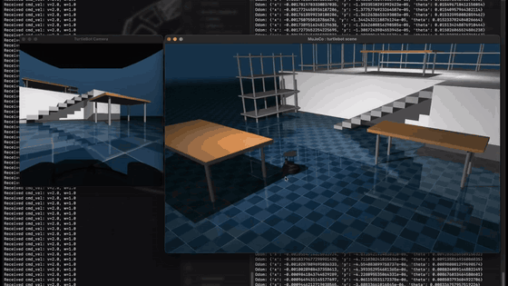

<div align="center">

# mujoco-examples

### ROS-style robot simulations in plain Python

**[Eric Plaß](https://github.com/erelbng)**

HTWK Leipzig

<p>
    <a href="https://erelbng.github.io/mujoco-examples/" target="_blank"></a>
    <a href="https://github.com/erelbng/ros-examples" target="_blank"></a>
    <a href="LICENSE"></a>
</p>
<p>
    
    
    
    
</p>

</div>

---

**mujoco-examples** provides ready-to-run **MuJoCo** simulations of a **TurtleBot 4** mobile robot and a **PincherX 100** manipulator. Each robot runs behind a **FastAPI WebSocket** server that works like ROS topics, so you can control it and read its sensors from a few lines of Python, without installing ROS.

This repository mirrors [ros-examples](https://github.com/erelbng/ros-examples), but runs directly in Python. It is meant for quick experiments, visualization and cross-platform use, **Windows included**.

---

## Demos

<table>
  <tr>
    <th width="50%">TurtleBot 4: driving with <code>cmd_vel</code></th>
    <th width="50%">PincherX 100: pick &amp; place</th>
  </tr>
  <tr>
    <td><a href="https://erelbng.github.io/mujoco-examples/#demos"></a></td>
    <td><a href="https://erelbng.github.io/mujoco-examples/#demos"></a></td>
  </tr>
</table>

Full-resolution videos: [`tb4_sim.mp4`](docs/assets/tb4_sim.mp4) · [`pincherx_sim.mp4`](docs/assets/pincherx_sim.mp4)

---

## Examples

### [turtlebot](turtlebot)
A [TurtleBot4](https://clearpathrobotics.com/turtlebot-4/) implementation in FastAPI using *MuJoCo* and *OpenCV*. It streams odometry and an onboard camera image for *data science* and *computer vision*.

| Direction | Message |
|---|---|
| Command | `{"cmd_vel": {"linear_x": 2.0, "angular_z": 1.0}}` |
| State | `{"odom": {"x", "y", "theta"}, "image": "<base64 JPEG>"}` |

### [pincherx](pincherx)
A compact manipulator arm ([PincherX100](https://www.trossenrobotics.com/pincherx100)), implemented in FastAPI using *MuJoCo* and *OpenCV*. Use it for teleoperation, pick-and-place and similar tasks.

| Direction | Message |
|---|---|
| Command | `{"joint_commands": {"names": ["waist", "shoulder", "elbow", "wrist", "gripper"], "positions": [...]}}` |
| State | `{"joint_names", "joint_positions", "joint_velocities", "image": "<base64 JPEG>"}` |

---

## Quick Start

```bash
# Install dependencies
pip install mujoco numpy opencv-python fastapi uvicorn websockets

# Terminal 1: start a simulation server (use mjpython on macOS if the viewer fails)
python3 turtlebot/turtlebot_sim.py      # or: python3 pincherx/pincherx_sim.py

# Terminal 2: connect the example client
python3 turtlebot/turtlebot_client.py   # or: python3 pincherx/pincherx_client.py
```

The server listens on `ws://localhost:8000/ws`. On each 20 ms tick, it applies the latest command, steps the physics, renders the robot camera and sends back a state packet.

---

## BibTeX

```bibtex
@misc{mujoco2025examples,
  author = {Eric Elbing},
  title  = {mujoco-examples},
  month  = {October},
  year   = {2025},
  url    = {https://github.com/erelbng/mujoco-examples}
}
```

## Contact
For technical support and other questions, contact [eric.elbing@htwk-leipzig.de](mailto:eric.elbing@htwk-leipzig.de).
